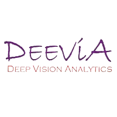

.. Vibration Monitoring System documentation master file, created by
   sphinx-quickstart on Mon Mar 10 17:29:00 2025.
   You can adapt this file completely to your liking, but it should at least
   contain the root `toctree` directive.

Vibration Monitoring System 
===========================================

Welcome to the Vibration Monitoring System documentation. This comprehensive guide provides detailed information about the system architecture, components, installation, usage, and maintenance.

About This System
----------------

The Vibration Monitoring System (VMS) is designed to monitor and detect vibrations using camera feeds. The system integrates with Programmable Logic Controllers (PLCs) for control functions and stores vibration data in a PostgreSQL database for analysis and reporting.

This documentation is based on the comprehensive ``project_details.md`` file and has been organized into logical sections for easy navigation.

.. toctree::
   :maxdepth: 2
   :caption: Contents:

   introduction
   installation
   usage
   api_reference
   troubleshooting
   maintenance

Project Documentation
-------------------

.. toctree::
   :maxdepth: 3
   :caption: Full Project Details:

   project_details
   
Indices and tables
==================

* :ref:`genindex`
* :ref:`modindex`
* :ref:`search`
